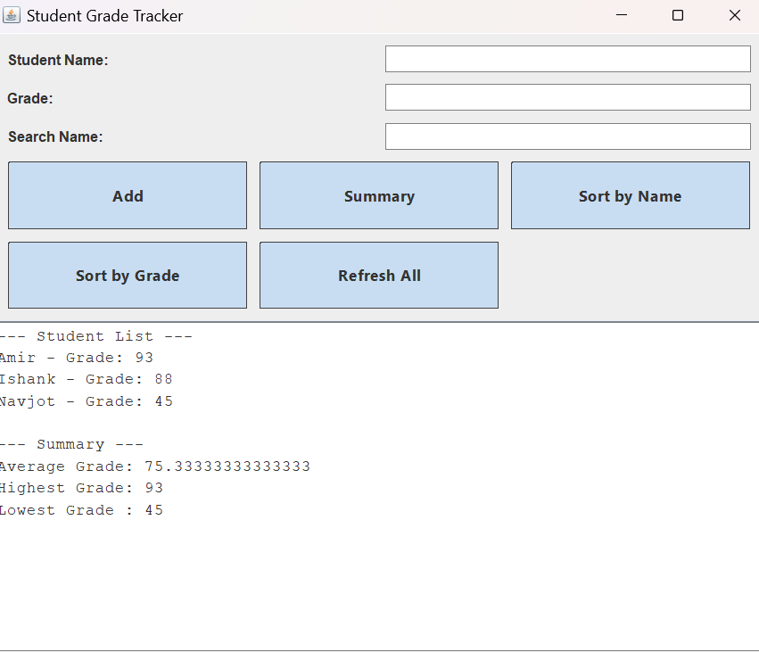

# 🎓 Student Grade Tracker (Java GUI Project)

A clean and modern **Java Swing GUI application** to manage student names and grades.  
You can add students, sort records, view summaries, and search in real-time.  
This version features an enhanced interface with **rounded buttons**, **aligned layout**, and no external libraries.

---

## 📸 Preview



---
```

Then it will display like this:


---

## 🧩 How to Use This Project

1. Place all files in the **same folder**:
   - `Student.java`
   - `StudentManager.java`
   - `StudentGradeTrackerGUI.java`

2. Open terminal/command prompt and compile:

```bash
javac Student.java StudentManager.java StudentGradeTrackerGUI.java
```

3. Then run the program:

```bash
java StudentGradeTrackerGUI
```

4. A GUI window will open, allowing you to:
   - Add a student with name and grade
   - Search using the Enter key
   - Sort records
   - See summary statistics
   - Reset everything using the Refresh button

---

## ✅ Features

- ➕ Add student name and grade
- 🔍 Search student by name (press **Enter** after typing)
- 📊 Show summary (Average, Highest, Lowest)
- 🔀 Sort by Name or Grade
- ♻️ Refresh button clears all inputs and saved records
- 💾 Auto-saves student list to `students.txt`
- 🎨 Polished and aligned layout (rounded buttons, unified spacing)

---

## 📁 File Structure

```
student-grade-tracker/
├── Student.java
├── StudentManager.java
├── StudentGradeTrackerGUI.java
├── README.md
├── .gitignore
└── assets/
    └── screenshot.png
```

---

## 🧾 .gitignore (recommended)

```
# Ignore compiled files
*.class

# Ignore student data file
students.txt

# System / editor settings
.vscode/
.DS_Store
*.log
```

---

## 💻 Tech Stack

- Language: **Java**
- GUI: **Swing**
- No external dependencies or libraries

---

## 👨‍💻 Author

- **Your Name**
- GitHub: [@your-username](https://github.com/your-username)
- Submitted to: *Your Institution / Teacher / Course*

---

## 📝 Notes

- `students.txt` is created automatically to store student data.
- Pressing **Enter** in the search box will search for the student directly.
- You can delete `students.txt` to reset the application permanently.

---
